# Source synchronization: authority, linked checkouts, and merge

The server owns the accepted source revision. A linked checkout is a peer:
its daemon submits local changes against the last accepted revision and applies
accepted changes from other peers. There is no last-writer-wins fallback.

## What a person does with this

This is one system seen from several places. Work reaches the accepted revision
by one of three routes, and leaves it by a fourth:

| where a person edits | how their work reaches the accepted revision |
| --- | --- |
| a linked local checkout | their daemon submits the file when they save |
| the browser source editor | the room checkpoints the text |
| a linked Git remote — Overleaf or any other | its daemon submits like any other checkout |

**They get it back out with `tlda merge`**, specified in the next section. Three
ways in, one way out.

Two rules hold everywhere below, and a person can rely on them without reading
the mechanism:

- **Nothing overwrites a file somebody is editing.** Every path here either
  applies to a clean file or refuses and reports, leaving the file byte-identical
  to what its owner wrote. Where that has been broken it is recorded as a known
  gap rather than described as working.
- **The server never resolves anything.** It accepts, refuses, and reports. All
  resolution happens on a box with a person or an agent on it. This is the same
  rule as [the notification design](notifications-and-liveness.md), one system
  over: the server reports, it never remedies.

## Getting the work back out: the merge operation

`tlda merge` takes the version history tlda has accumulated for a project and
lands it on a real branch — the author's own repository, or a linked remote such
as Overleaf.

**It is one module with two call sites**, the CLI and the server, rather than two
implementations. A second copy is how the two ends come to disagree about what a
merge is, and the server's copy is the one nobody watches.

### Why it is a replay and not a merge

The shadow repository is built by cloning the project repo and running
`git-filter-repo --path <scope> --force` (`server/lib/shadow-repo.mjs`, in the
`projectRepoPath` branch of the builder). `filter-repo` rewrites every commit to
contain only the scoped paths, and rewriting a commit changes its sha. So **the
shadow shares no commit identity with the project repo.** The builder says so
itself, a few lines below, explaining why it removes the origin remote:

> the project repo is not upstream of the shadow

Nothing in the shadow can merge back by git identity. It can only be re-applied
as content. `tlda merge` therefore **replays**: `git format-patch` on the shadow
side, `git am` on the target. Author, date and message survive, so the target
gains one commit per real change rather than a single commit standing for all of
them.

The filter is a plain `--path` with no rename, so the shadow keeps the project's
original paths and patches apply where they belong with no translation.

New shas on the target side are expected and are not a problem to be solved.
Commits are matched by `git patch-id` — a hash of the normalised diff, identical
for two commits that make the same change whatever their shas. The technique is
already in this tree, in `bin/branch-landed.mjs`, for the same reason: `main` is
assembled by cherry-pick, so shas differ there too.

### Marching forward, not all at once

`am` applies patches in sequence and stops at the first one that conflicts,
leaving `--continue`, `--skip` and `--abort`. **That is the required behaviour,
not an implementation detail to work around.**

Stopped at patch N, the conflict is attached to *that* patch, carrying its
message and its author. Collapsed into one diff, a person gets a conflict against
a blob and no way to tell which change caused it.

### The two modes

| mode | what it does | who runs it |
| --- | --- | --- |
| `--ff-only` | plays the whole sequence atomically — every patch applies, or the target branch does not move at all | the server, unattended |
| default | plays patches until one needs a human decision, then stops with that conflict in the working tree | a person or an agent, on a box |

**`--ff-only` must apply to a scratch ref and move the real ref only on
success.** `am` is not atomic: fail on patch five and patches one through four
are already on the branch. Without the scratch ref, "atomic" quietly means a
half-applied branch — the one state the server must never be able to reach.

### What the server does when it cannot fast-forward

- **Fast-forward** → the server applies it. Nothing to resolve, safe unattended.
- **Not fast-forward** → the server stops and says so, and hands the branch off:
  *take this branch, run `tlda merge` without `--ff-only` on your box, resolve
  it, and submit the finished branch back.* The server then fast-forwards what
  comes back.

The property this buys is the reason for the rule: **the server can never be in
a conflicted or half-merged git state.** There is nothing for it to wedge in and
nothing anyone has to go clean up on it.

**What comes back to the server is a finished branch, never a half-applied
merge.** A paused `am` lives in `.git/rebase-apply` on the box that paused it and
is not transportable.

### Every participant is a real process with git behind it

`tlda merge` shells out to `git`. That settles something outside this document:
the browser editor's daemon has to be a real process on a box with a git binary,
not something living in the page. The rule that forces it is the existing one —
every editor is a participant with a daemon — so it is decided once, for all
participants, rather than per surface.

### Where each rule above comes from

This section was specified from one conversation, 2026-08-22 14:30–14:53 EDT.
Every normative statement traces to a message in it, and the three that do not
come from Skip directly are marked **inferred** rather than presented as his.

| rule | source |
| --- | --- |
| replay the patches one by one onto a clean copy of the target, then merge | Skip, 14:33:57 |
| the operation is `git am` | Skip, 14:46:31 |
| new shas are fine; what matters is that commits are matchable | Skip, 14:36:34 |
| matching is by `patch-id` | **inferred.** Skip said "matchable via tagging pretty fucking simply" (14:36:34); `patch-id` was proposed to him at 14:38:14 as getting it for free, and he moved on without choosing between them. See the open point below. |
| marching forward, not all at once | Skip, 14:47:18 |
| `--ff-only` plays the whole sequence atomically; the default plays until a merge is required, stops, and is called again after resolution | Skip, 14:47:45 |
| `--ff-only` applies to a scratch ref | Skip, 14:49:03 — "Yes. Scratch ref. Of course" |
| one operation, in the CLI and usable on the server | Skip, 14:41:10 |
| one module with two call sites rather than two copies | **inferred.** Put to him at 14:41:41; he did not respond to that point specifically. |
| the server runs `--ff-only`; on failure it hands the branch off, an agent resolves it on a box and submits the finished branch, and the server fast-forwards that | Skip, 14:43:16 |
| the server can therefore never hold a conflicted or half-merged git state | **inferred** as the consequence, stated at 14:44:10; Skip endorsed the scratch-ref half of it at 14:49:03 |
| a paused `am` is not transportable, so what comes back is a finished branch | put to him at 14:47:50; Skip, 14:48:18 — "Oh, yeah. Of course." |
| the browser editor is another box with a daemon | Skip, 14:44:59 |
| the operation shells out to `git`, so every participant's daemon is a real process | Skip, 14:46:18 and 14:46:31 |
| Overleaf reached either through the author's own repository or directly when configured that way | Skip, 14:41:10 |

### Open — not settled, and not for an implementer to choose

- **What the operation reads.** Whether `tlda merge` replays from
  `refs/tlda/shadow/HEAD` in the local checkout, which the daemon already
  maintains, or fetches the shadow from the server.
- **Whether the pairing is recorded or recomputed.** `patch-id` recomputes it for
  nothing; an `am` trailer carrying the shadow sha records it. Both were raised;
  neither was chosen.
- **The patch range.** What `format-patch` takes as its base on the second and
  subsequent merge of the same project.
- **Direct-to-Overleaf.** Fast-forwarding straight from the server to a linked
  remote was described as conditional on how the project is configured. That
  configuration surface is not specified.
- **Who is told when the server cannot fast-forward.** The hand-off above names
  no recipient. §"Outbound linked-checkout changes" records the same open
  question for rejected pushes and rules there that who receives a notification
  is a product decision rather than a sync one.

## A revision is a commit, and accepting is committing

Each project has a bare git repository at `.source-lifecycle/git`. A revision is
a commit in it: the tree is the manifest, a file is a blob, and the revision id
is the commit sha. Four refs carry the state, and the refs *are* the state:

| ref | means |
| --- | --- |
| `refs/tlda/source/<project>` | the accepted head |
| `refs/tlda/applied/<bindingId>` | what a checkout has on disk |
| `refs/tlda/mirrored/<project>` | the last revision a checkout took |
| `refs/tlda/refused/<project>` | the last push the server refused |

Advancing the head is a compare-and-swap, so two overlapping accepts cannot
interleave into a half-applied state and the loser fails loudly rather than
landing last and winning.

**Accepting a push commits it, and that commit is mirrored into the author's
checkout.** That is what versions their work, it is driven by the accept and not
by a build, and nothing has to remember to do it afterwards. That is the
specified behaviour.

**It is not what currently happens, and this document said it was.**
`mirrorShadow` in `server/lib/build-runner.mjs` is the only function that builds
a shadow bundle and hands it to the daemon, and **nothing calls it.** Moving the
mirror off the build tail removed the one caller; no accept-side caller replaced
it. So the author's checkout gains no commit on any push, whether or not the
build succeeds.

Measured 2026-08-22 on a throwaway project with real shadow history: three
edit → push → build cycles produced **zero preservation commits and zero shadow
tags**, while the author's branch moved only by their own commits.

**Wiring proves reachability; it does not prove invocation**, and this path is
the case that separates them. Every hop exists and every registration runs —
`setShadowMirrorHandler` at server start, `mirror-shadow-ref` registered on the
daemon, `mirrorShadowRef` calling `preserveAuthorCommit`. Reading the call graph
from either end reports the feature healthy, because reachability is all a call
graph can see. Only running it, or looking for the commits it should have
produced, says otherwise. **Do not re-verify this section from the call graph.**

Three consequences that are easy to get wrong:

- **A revision id is not a function of its content.** A commit carries when it
  happened and what it followed, so identical bytes accepted twice are two
  revisions. Anything asking *do these say the same thing* — bootstrap's
  reconciliation check, for one — compares manifests, not ids.
- **Content is named by git's blob id everywhere**, in `shared/git-blob-id.mjs`.
  The server's manifests, the daemon's materializer, the watcher's drift check
  and the replica payload all have to agree, because a file that reads as
  changed on one side and unchanged on the other becomes a whole-project push,
  and a whole-project push is how passages get deleted.
- **Revisions accepted before this keep their `sha256:` ids** and stay readable
  at them. Nothing writes that shape any more, and the first accept after the
  cutover carries their bytes into git, so no project needs a migration pass.
  `revisionFileHash` converts a legacy entry into git's space before comparing —
  without it, every untouched file on the one push crossing the cutover reads as
  moved by both sides.

### What the mirror does to a checkout someone is writing in

The mirror compare-and-swaps the author's real branch, so what it does to a
checkout somebody is working in is load-bearing rather than incidental. This is
the contract it must honour when it runs; per the section above it is not
currently reached at all:

| in the checkout | what happens |
| --- | --- |
| clean | the branch advances to the accepted revision |
| unstaged edit | the branch advances and records the **accepted** version; their file on disk is untouched and reads afterwards as an uncommitted modification |
| staged conflicting change | **refused** — `validateTargetIndex` throws, the branch does not move, and `refs/tlda/mirrored` does not advance |

Recording the accepted version rather than skipping the file is Skip's ruling,
2026-08-11 19:41:53 EDT, asked in plain terms whether the snapshot should record
the version that was built or skip the file: *"The version that was built,
please."*

**Nothing in the mirror writes a working-tree file.** The verbs it runs are
`bundle`, `cat-file`, `commit-tree`, `fetch`, `hash-object`, `log`, `ls-files`,
`ls-tree`, `read-tree`, `rev-parse`, `symbolic-ref`, `update-index`,
`update-ref`, `write-tree`. `checkout`, `reset`, `restore`, `merge`, `switch`,
`stash`, `clean` and `pull` appear nowhere — not in a fallback, not in an error
handler. Preservation commits through a temporary index (`GIT_INDEX_FILE`), so
the only write outside `.git`'s refs and objects is the git index, which exists
to keep `git status` honest after HEAD moves. Known gap: if `refreshRealIndex`
throws after the ref moved, the index is stale and `git status` misreports until
the next successful mirror. That is confusion, not loss.

This is why `mirrorPaused` is gone rather than repurposed. It existed because the
build-era mirror committed the *shadow's* content, which lags the accepted source
and **does not converge** — while a render was wedged it re-applied its stale copy
on every build, and on 2026-08-17 four mirror commits took the same two changes
out of bregman's HEAD. The accepted revision is the head, so the new path cannot
be stale by construction, and anything newer arrives with the next accept.

### A refused push is something its author can look at

`submit` commits the incoming snapshot **before** it tests staleness, so a
refused push has always been a real commit and nothing about it was ever lost.
What it lacked was a ref. `refs/tlda/refused/<project>` names it, the mirror
carries it — in its own refspec, because it is a *sibling* of the accepted
commit rather than an ancestor and the head's fetch does not reach it — and the
daemon writes it to `refs/tlda/refused/HEAD` in the checkout.

So `git diff HEAD refs/tlda/refused/HEAD` exists, instead of the author's work
sitting in a rejection payload on a server where the one person who can fix it
cannot see it. **It is a pointer, not an application**: the refusal stands and
HEAD is untouched.

**Diff it against the manifest, not against the whole branch.** The refused
commit carries the project's source set; the author's `HEAD` carries their
repository, which is usually much larger. On a real paper on 2026-08-18 the
bare form read `1270 files changed, 26 insertions, 185,925 deletions` — the
actual disagreement buried under deletions for screenshots, outlines and backup
files that were never in the push, and it was one message away from being
reported as a mass deletion.

```sh
git diff HEAD refs/tlda/refused/HEAD -- <the paths in the revision>   # e.g. main.tex
```

**The noise is not a flaw in the ref.** It is the gap between the paper and the
repository it lives in, and it is why membership is `tracked in git` rather than
an extension test — a checkout that carries only the paper produces a readable
diff from the bare form.

It is mirrored **on the refusal**, not on the next accept. A stalemate is a run
of refusals with no accept between them, so a refused revision waiting for an
accept to carry it would wait exactly as long as the author was stuck.

## Server authority

Each project authority is in exactly one of these states:

- `uninitialized`: no accepted source revision exists.
- `current(revision)`: `revision` is the accepted immutable snapshot.
- `reconciliation-required`: bootstrap found different server and submitted
  source, so neither is silently chosen.

```mermaid
stateDiagram-v2
    [*] --> uninitialized
    uninitialized --> current: bootstrap(null, matching or empty server source)
    uninitialized --> reconciliation_required: bootstrap(null, differing server source)
    current --> current: submit(expected = current)\naccept immutable snapshot
    current --> current: submit(expected != current)\nreject stale-base; authority unchanged
    reconciliation_required --> reconciliation_required: ordinary submit rejected
```



The compare-and-set rule is the whole server decision: a mutation is accepted
only when its `expectedRevision` equals the current revision. A stale submission
does not mutate authority. It receives the current revision plus per-file
three-way classifications derived from its base, current, and incoming
snapshots.

Project source operations are serialized per project before this rule runs.
After an accepted mutation, the server durably sends that exact accepted
revision and changed bytes to every connected daemon except the daemon that
originated it. A daemon that does not own a linked checkout declines with
`project-not-watched`.

## Outbound linked-checkout changes

For each linked project, the daemon tracks one accepted revision and permits one
source submission in flight. Additional local filesystem changes are merged
into one queued payload.

```mermaid
stateDiagram-v2
    [*] --> idle
    idle --> in_flight: local change\nsubmit(expected = accepted revision)
    in_flight --> queued: another local change
    in_flight --> idle: accepted\nadvance accepted revision
    queued --> in_flight: accepted\nadvance revision; submit merged queue
    in_flight --> retrying: first stale-base\nlearn current revision; retry once
    retrying --> blocked: second stale-base
    retrying --> idle: conflict reported\nlocal copy untouched\nwait for human save
    blocked --> idle: authoritative project sync supplies a new revision
    in_flight --> queued: connection lost\nmerge unknown request into queue
    queued --> in_flight: reconnect + authoritative revision seed
```



The retry is bounded to one stale-base response. If the server supplied a
textual merge conflict, the daemon **reports it and stops deciding**, leaving
the linked checkout byte-identical to whatever its owner wrote. The person's
next save is a new ordinary submission. A second stale-base without a conflict
to report blocks automatic submission until an authoritative project sync
changes the known revision.

This document said until 2026-08-18 that the daemon *writes those markers into
the linked checkout*. It stopped doing that in `cf6e30cf0`, because it was
overwriting a file its owner was editing — on 2026-08-17 it replaced
voice-dictated text four times in one session. **The merged text is on the
server and is not currently surfaced anywhere a person can see it.** That is a
known gap, recorded here rather than described as working.

Known follow-up: non-conflict source-change rejections now surface as critical
daemon warnings, but the warning goes to the server owner and not to whoever
made the push that was rejected. So the person who can fix it is the one person
not told.

The ownership shape it was waiting on has since landed, and the remaining work
is smaller than "route it to the owner" sounds — but not as small, and the
recipient is the part to get right rather than the plumbing:

- **Notify the actor, not the machine.** A push carries `editedBy`, which is a
  fleet agent id: the daemon resolves it through `resolveEditor`, which returns
  the agent whose session touched the file. That is one recipient and it is the
  right one.
- **Do not fan out by daemon key.** `getAgentsByDaemonKey` exists and is the
  tempting route, but a daemon serves many agents, so that turns one person's
  rejected push into a broadcast to everyone seated on their machine.
- **The warning does not carry the actor yet.** `daemon-warning` is sent from
  `handleSourceChangeResult`, which sees the server's response rather than the
  push that caused it, so `editedBy` has to be threaded back through the
  correlation that holds the in-flight payload. That is the actual work, and it
  is a change to a delivery path rather than a one-line recipient edit.

Whoever takes it: this is a change to who receives a notification, which is
closer to a product decision than a sync fix, so it wants a judgement before it
lands rather than after.

A second gap in the same family was found on a real paper rather than in a
fixture: **a stale-base refusal with no textual conflict recorded nothing.**
Conflict state is written from the classifications that came back as `conflict`
— files with marker text in them. A refusal where nothing produced markers (a
binary both sides replaced, or any refusal the rebase could not settle) left
`sourceSyncConflicts` empty, so the pill stayed quiet and the paper looked fine.
The person who pushed learned by their HTTP status; nobody else learned at all.
Measured on 2026-08-13: a participant holding a stale revision edited a
bibliography nobody had touched, was refused, and the project's conflict state
stayed empty.

**The record now exists. What is shown has not changed.** A refusal with no
conflict files is written to `sourceSyncRefusals` by the push route, and
`sourceSyncLedger` reads both fields. Three things about its shape:

- **It is per person, not per file.** Being stuck is a fact about a participant
  whose machine cannot reach the paper, so repeated refusals collapse to one row
  keeping the *first* timestamp — the age that matters is how long they have
  been stuck rather than when they last retried. Any accepted push from them
  clears it.
- **It can name no file and still be a row.** A conflict without a file is
  nothing; a refusal without one is still somebody outside the paper.
- **It is deliberately not `sourceSyncConflicts`.** That field is what the
  conflict pill reads, and what a person is shown is a product decision rather
  than a sync one. Deciding to surface these is a separate change with a
  separate judgement.

`bin/a-refusal-that-left-no-trace-test.mjs` is the story, and it crosses the
push route because the recording is something the route does with what the
lifecycle refused — calling both halves from one process would prove both halves
and nothing about whether a refusal reaches the record.

### A failed checkpoint leaves the editor room holding the text

The same family, one layer up. When a source room's checkpoint fails for a
reason that is *not* a conflict — the server busy, the store closed, anything
that is not somebody else's edit — `flushRoom` sets `room.queued` and schedules
nothing. The flush timer is armed by a local edit and by the tail of a
successful push, and a failure is neither, **so the text sits in the room until
somebody happens to type again.**

Everyone with that file open sees an `error` status. Nobody else sees anything,
and the text has not reached the authority, so it is losable in the sense that
matters here: a server restart takes it.

The room now records that it is holding an edit, per file, and clears it on the
next successful checkpoint. **It does not retry**, deliberately — this domain is
detection rather than prevention, and adding a retry loop to a push path is a
behaviour change that wants deciding on its own rather than smuggled in behind
an instrument. Whoever picks that up: the room already pushes its whole text
rather than the failed edit, so a later successful checkpoint carries the held
paragraph in by itself. That is what the story asserts.

The recorders reach the room by injection (`recordHeldEdit`, `clearHeldEdit`)
like everything else that file touches. That is not ceremony: the room tests
stand up their own project store, so a direct import would write these into a
different store than the one under test and report nothing while looking wired.

The story is the third section of `bin/an-edit-that-reached-nowhere-test.mjs`,
which is also where the checkpoint window itself is measured.

### Something has to look at the clock

Both records above are written when the failure happens. **Neither writes
anything at the moment it becomes old**, and the alarm here is age, so a ledger
with no sweep is a data structure rather than an instrument.

`staleSourceSyncEntries` is that sweep, kept pure, ordered oldest first across
every project — the question a person asks is *what is worst*, not *what is
where*. The server runs it on a timer (`TLDA_SOURCE_SYNC_SWEEP_MS`, five
minutes; `TLDA_SOURCE_SYNC_STUCK_MS`, thirty) off one `listProjects()` call
rather than a file read per project, logs `[source-sync-stuck]` with a sentence
per entry, and records a `source-sync-stuck` perf event.

Three things about it are deliberate:

- **It speaks when the set changes, not every five minutes.** A line repeated
  until somebody mutes it is a line nobody reads. It also says so when the last
  thing clears, because silence that means "fixed" and silence that means
  "nothing ran" are otherwise the same.
- **An entry younger than the threshold is not news**, but one with **no
  readable age always is** — the thing nobody can say is fine must not be
  averaged in with the thing that is.
- **A failing sweep logs and continues.** An instrument must never be what takes
  the server down.

`bin/a-refusal-that-left-no-trace-test.mjs` runs the sweep through
`listProjects()`, the same call the timer makes, because a field that did not
survive the store read would leave it reporting an empty fleet forever while
every assertion against a hand-built project object still passed.

**What the sweep still cannot see, and why it is a bigger piece than it sounds.**
Both entries above start from something the server watched happen. The third
losable state does not: **a linked checkout with local edits that has simply
stopped pushing** — the daemon quiet, asleep, offline, or never having tried.
Nothing was refused, so nothing was recorded, and the sweep reports the paper as
clean.

The server cannot compute this. A daemon being behind the current revision is
ordinary and harmless on its own; it is only losable when that checkout **also
holds unsubmitted local edits**, and the pending set is knowledge the daemon has
and the server does not. So closing it is not another read over project state —
it needs the daemon to report *"I am holding N changes, the oldest since T"*,
a receive path for that, and the ledger merging it with what is already there.

Three things to get right, for whoever takes it:

- **The daemon reports, the server records.** Per §"The server reports daemon
  facts; it does not own daemon state" — the server must not model which
  checkouts exist or infer staleness from silence.
- **Silence is the case that matters, and a report cannot cover it.** A daemon
  that never speaks is exactly the daemon whose laptop is closed. So the record
  has to age the *last* report rather than wait for the next one, which is the
  same rule as everything else here: an instrument that only knows what it was
  told must not read absence as health.
- **It ships on a different clock.** The daemon half is deployed by restart from
  the shared checkout, not by a server deploy, so the two halves are live at
  different times and each has to behave alone.

## Applying an accepted remote revision locally

The local decision is per changed path. Let:

- `baseline` be the fingerprint recorded when the watcher last knew the path
  was synchronized;
- `pending` mean the watcher has observed a local edit that has not yet been
  submitted;
- `drifted` mean the current filesystem fingerprint differs from `baseline`;
- `same` mean the current bytes already equal the accepted remote bytes.

| Local condition | Text file | Binary file |
| --- | --- | --- |
| `same` | Leave unchanged | Leave unchanged |
| neither `pending` nor `drifted` | Apply accepted bytes | Apply accepted bytes |
| `pending` or `drifted` | Refuse, report the conflict, leave the file untouched | Refuse and emit a critical warning |

Deletion uses the same rule: an unchanged path is deleted; a pending or drifted
text path is refused and reported rather than rewritten; a binary delete
conflict is refused and surfaced.

`pending` and `drifted` are deliberately independent. A filesystem watcher
updates its recorded fingerprint when it observes an edit, so checking only
fingerprint drift can misclassify that observed-but-not-yet-submitted edit as a
clean baseline. The pending set preserves that state until submission.

Writes made by an accepted remote update are marked `remoteApplied`; the watcher
consumes that marker instead of echoing the same bytes back to the server.
After a successful apply, the daemon advances to the accepted `sourceRevision`.

## Executable checks

The implementation is checked at the same boundaries:

- `bin/source-lifecycle-authority-test.mjs`: authority bootstrap,
  compare-and-set acceptance, stale-base evidence, and
  reconciliation-required.
- `bin/source-change-correlation-test.mjs`: one in-flight submission, queue
  merging, bounded retry, blocking, and reconnect behavior.
- ~~`bin/source-conflict-delivery-test.mjs`: stale-base conflicts and automatic
  retry stopping.~~ **Deleted in `672ba4d90`.** Stale-base conflicts and
  automatic retry stopping have no named check here since; see the note below.
- `bin/source-server-update-apply-test.mjs`: a clean accepted server edit reaches
  a linked checkout, while a watcher-observed pending local edit is refused and
  reported with the local file left byte-identical.
- `bin/an-unanswered-source-push-releases-the-project-test.mjs`: a submission
  whose reply never arrives is released at a bounded deadline instead of pinning
  the project, its expiry is loud, and the late answer that arrives afterwards is
  dropped rather than applied to a newer base.
- `bin/an-edit-made-before-a-restart-is-still-pushed-test.mjs`: an edit made while
  the daemon was not running is detected by content against the revision the
  checkout holds, since a fingerprint cannot survive a restart.
- `server/lib/push-base-means-content.test.mjs`: over a real daemon-to-server
  wire, a push whose base names a revision this checkout was refused permission
  to materialize does not delete what it was refused, and ordinary
  non-overlapping contention still merges and accepts with no human involved.

The live acceptance gate is the same final transition: start from one accepted
revision, pause the owning daemon, make divergent local and server edits, then
resume it. **The linked checkout must be byte-identical to what its owner
wrote**, the conflict must be reported, and the server must still hold its own
side — neither side's text may be lost.

Until 2026-08-18 this gate read *"the linked checkout must contain both sides as
conflict markers."* No implementation could have passed it since `cf6e30cf0`,
and nothing complained.

Added 2026-08-18 with the move to commits:

- `bin/a-commit-per-accepted-push-test.mjs`: accepting a push commits the
  author's checkout with no build involved, one commit per push, and the second
  bundle carrying only what the checkout lacks. It also holds the three
  dirty-checkout rows above, the refused push readable at
  `refs/tlda/refused/HEAD`, and the forward-only rule for
  `refs/tlda/mirrored`.
- `bin/mirror-failure-visible-test.mjs`: a failed mirror still reaches
  `SyncErrorPill`, and does **not** throw — a push must not be rejected because
  a laptop is asleep.

`a-commit-per-accepted-push` crosses the bundle format and the daemon receiver
applying it to a real repository. It does not cross the WebSocket, which is
covered by `bin/shadow-mirror-rpc-adapter-test.mjs`.

**And it does not cross the accept.** It calls `mirror.mirrorShadowRef(...)`
itself, with a payload it built. So it exercises the receiver and never the
trigger: it is a true statement about what the daemon does when it is asked, and
no evidence that anything asks.

**It also does not currently run.** Line 66 calls `lifecycle.readAuthority()`,
and **`readAuthority` has no definition anywhere in the tree** — a rename that
reached its callers and never its definition; `bin/source-restart-mid-edit-test.mjs`
records the intended name as `state()`. Executed 2026-08-22 on `main`:
`TypeError: lifecycle.readAuthority is not a function`, thrown before the first
assertion. **Twelve files call it**, eleven of them tests and one of them
`bin/repair-source-replica-target.mjs`, which is a repair tool rather than a
test.

So the file named for proving a commit-per-push fails to cover it for two
independent reasons: it cannot reach the trigger by construction, and at present
it cannot reach its assertions at all. **The list above is a list of intended
checks, not of passing ones** — `bin/source-lifecycle-authority-test.mjs` is red
too, from a different cause, failing at import on a missing `classifyThreeWay`
export. Neither was known to be red before 2026-08-22, and both are named here
as things that check the implementation.

**A test's colour is not a property you can read off its code**, any more than
invocation can be read off a call graph. Both failures in this section came from
believing a file did what it was named for. Run it.

**Both colour notes this section carried were wrong, in opposite directions, and
each had outlived its subject.** Re-run on `main`, 2026-08-22:

- `bin/shadow-mirror-rpc-adapter-test.mjs` was recorded here as **known red**,
  expecting RPC params without `sourceRevision` and `acceptSeq`. It **passes.**
  Somebody repaired it and the note outlived the repair — and a stale red is the
  worse direction, because it hides a real one.
- `bin/source-conflict-delivery-test.mjs` was recorded here as **green as of
  2026-08-18**. **The file does not exist.** It was deleted in `672ba4d90`, "Cut
  daemon source sync over to Git proposals". This section named it twice, once
  as a check on stale-base conflicts and once as a colour, for a file that had
  been gone the whole time. The nearest live successor is
  `bin/a-conflicted-checkout-reports-synced-test.mjs`, which is not the same
  check and is not asserted here to be one.

**So a colour written into this document is worth nothing after the day it was
written**, and neither is a filename. Both entries above read as current, both
were checkable in one command, and nobody ran either. When you cite a check
here, run it that day and date the result — or cite it as an intended check and
say you did not run it.

**There is a second live gate, for versioning rather than for conflicts:** the
author's checkout gains a commit for work they did that never built. Start from
a project whose build is failing, edit a source file on the linked machine, and
let the push land. `git log` in the checkout must show a commit carrying that
edit, and their working copy must be untouched.

## A push cannot carry a file larger than one request

`sourceFileBatches` bounds a push at 20 MiB of raw bytes. Two things about that
bound are not true, and a 488-file course book with 33 MB CSVs found both on
2026-08-12.

**The bound is in the wrong units.** The request body is base64 inside JSON, so
20 MiB of raw bytes leaves as roughly 27 MiB on the wire, against a server that
accepts `express.json({ limit: '50mb' })`. The bound and the limit measure
different things, so staying under the bound says nothing about staying under the
limit.

**And a file bigger than the bound cannot be batched at all.** The batcher starts
a new batch only when the current one is non-empty — correct, because a file
cannot be split — so a 33 MB file becomes a 33 MB batch and about 44 MB of body.
That is under the server's limit and above what it survives: the observed result
was a request timeout followed by the box being unreachable, health included.

So the bound works for the small files and is structurally unable to help with
the large ones. Whatever replaces it, three things have to be true rather than
one: the bound measures encoded bytes, a single oversized file has an answer that
is not "a batch of one", and a file the transport cannot carry is refused with a
sentence saying so rather than by taking the server down.

Until then, a project containing a file of that size cannot be pushed, and the
failure is a dead box rather than a rejection.
