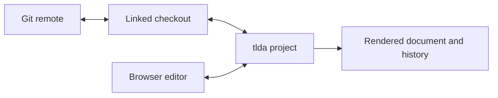
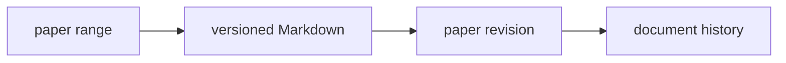

# Using tlda

This is the user reference for starting a project and working in it. It covers
project linking and history, identity, supported document formats, search,
agents, and a full-strength local setup. Exact command and tool arguments remain
authoritative in `tlda --help` and the running MCP schemas.

- [Identity, settings, editor, and voice](#identity-and-settings)
- [Project source, linking, and history](#project-source-linking-and-history)
- [Document formats](#document-formats)
- [Markdown documents](#markdown-documents)
- [Search and chat filters](#search-and-chat-filters)
- [Recording and playback](#recording-and-playback)
- [Agents](#agents)
- [A full research setup](#a-full-research-setup)

## Identity and settings

Open settings from the gear tab beside the document’s table of contents and
notes. The same gear appears inside the document panel on a narrow screen.
Settings contains Account, Appearance, Voice, Input, and Bots.

Account chooses the identity collaborators and agents see:

- Entering a name in Account, or deliberately supplying `?name=`, stores that
  identity in the browser for later sessions.
- With no deliberate identity, tlda creates a temporary name for the browser
  session. A generated name never replaces an identity you chose.
- Ordinary preferences are stored for the active identity. Device names and
  readability profiles distinguish different devices using it.

This identity selection is not the server’s security boundary. A hosted server
still needs the authenticated network or proxy boundary described in
[Hosting tlda](hosting.md).

Set up source navigation once with:

```bash
tlda config setup editor
```

Zed is the default; the command also supports VS Code (`code`), Cursor,
VSCodium, Neovim, Vim, and Sublime Text. Voice is optional and explicitly
selected in settings; tlda does not silently substitute a different voice
backend.

The document’s lower-left status surface reports the state that can affect the
work: connection and source synchronization, builds, warnings or errors, and
collaboration presence. Treat an error there as part of the document, not as a
background log.

## Project source linking and history

You can link a local working copy, an Overleaf project, or another Git remote to
a tlda project. Local editing, browser editing, and history then stay connected.



The intermediate server copy and shadow repository are implementation details;
you do not create or manage them separately.

From an existing Git working copy, pass its document root or roots:

```sh
cd /path/to/my-paper
tlda project link my-paper paper.tex
```

Linking seeds the version wheel from the current working copy's Git history. By
default the seed ends at the checked-out branch's `HEAD`. Positional paths are
document roots. Use `--version branch@commit` to choose another endpoint:

```sh
tlda project link my-paper paper.tex supplement.tex \
  --version revisions@0b77278
```

Only each root and the files it includes are retained in the seeded history.
Unrelated files and commits that changed only those files do not become document
versions. If the checkout already contains mirrored tlda history, that history
is carried instead.

The local path belongs only to this machine's daemon binding. The daemon watches
the checkout and sends revision-checked source transactions to the server. The
link puts the checkout on `tlda/<project>` when Git can do that without forcing
local state. While that branch is checked out, tracked file changes and
deletions are committed and submitted automatically; new files are included
after you add them with Git. If the checkout is on another branch, the daemon
refuses to sync it and tells you to run `git checkout tlda/<project>`.
For Markdown, pass the document itself. tlda infers the format from the `.md`
extension and includes the local Markdown files and assets it links to:

```sh
cd /path/to/notes
tlda project link proof-notes README.md
```

### Adding a file to a project you already linked

`tlda project add` puts another document into a project without relinking it:

```sh
cd /path/to/my-paper
tlda project add supplement.tex
```

It does three things, in this order. If the file is present but untracked it
runs `git add` on it, which is what puts the file in the next submitted
revision — the daemon submits tracked changes only. It then appends the file to
the project's document roots, which is what makes the server render it as a
document of the project; the existing roots, their order and their formats are
untouched. Then it submits, so the document is in the project when the command
returns.

The order is not cosmetic: a declared document root that is not in the settled
tree stops the project syncing, and it does so quietly, so the file is staged
before it is declared.

**The project keeps the branch and history it already has.** Nothing is
unlinked, nothing is reseeded, and `tlda/<project>` does not move. Running the
command twice adds nothing the second time.

To take a file that is not in this working tree at all — one that exists only on
another branch — name the branch:

```sh
tlda project add notes.md --from main
```

That runs `git checkout main -- notes.md`, which writes the file into your tree
and stages it. It refuses rather than overwriting a file you already have.

Only a document can be a root: `.tex`, `.md`, `.markdown`, `.qmd`, `.html`,
`.htm`. Figures, `.bib`, `.sty` and other assets travel automatically as part of
a document's closure, so they are not added by hand.

### Git remotes

The checkout remains the project source when it also has a hosted Git remote.
Manage that remote through the project command:

```sh
tlda project remote add origin https://example.test/team/project.git
tlda project remote pull origin main
tlda project remote push origin main
tlda project remote checkout origin main
```

These operations are provider-neutral. `--github` is creation sugar: on the
initial `project link`, it creates a private repository through the authenticated
`gh` account, adds the returned Git URL through the same remote implementation,
and pushes the selected branch.

```sh
tlda project link notes README.md --github
```

Linking the same project to the same source is an idempotent no-op. Linking it
to a different local path on one machine fails without
changing the existing binding. Detach the exact source first:

```sh
tlda project unlink my-paper /path/to/my-paper/paper.tex
```

When you move an existing local tlda project to a new server, linking carries
the project's tlda version history with it and waits for the destination to
store it before creating the new binding. A link that cannot deliver the
history fails and leaves no binding behind, so you can fix the reported problem
and run the same command again. A project with a long history may take a moment
to link.

Local, Git-remote, and browser edits submit through the revision-checked source
transaction boundary. If the server accepted a newer revision first, the daemon
keeps that head, tries a Git merge against the local revision, and submits the
combined commit when the merge is clean. If Git reports conflicted paths,
unresolved files, or an in-progress merge, the daemon stops and leaves the
checkout for ordinary Git resolution. The server does not silently overwrite a
linked local checkout with a browser edit.

### When an edit does not appear

`tlda daemon log` shows the last 50 lines of
`~/.config/tlda/fleet-daemon<env-suffix>.log`, which is where the sync path
writes. **It records failures, not successes**, so read it with that in mind: a
settle that worked writes nothing, and the absence of a line about your project
is not evidence that nothing happened.

What you will see when something did go wrong, each prefixed with the project
name:

- `proposal not accepted: <status>` — the submission was refused. `WrongHead`
  means the server accepted someone else's revision first; `conflict-held` means
  your checkout and the accepted source changed the same content and both were
  kept; `merge-in-progress` means Git is mid-merge in your tree and the daemon
  will not touch it.
- `not in the revision — tracked, but no document root reaches them: <paths>` —
  the file is committed but no document includes it, so it is not part of any
  document. `tlda project add <file>` makes it a document of its own.
- `<document> references <path>, which is present but untracked` — the file is
  there but not staged, so it is not in the revision yet. `git add` it.
- `holding — the accepted source and this checkout both changed <paths>` —
  resolve it in the checkout with ordinary Git.

A refused settle is also reported to you outside the log, once per distinct
reason rather than once per attempt, and only when one of your own edits
triggered it.

For what happened to one particular revision — accepted, queued, built, failed —
the record is the project's revision history on the server rather than any log.

### Getting the app's history back into your repository

`tlda project merge` lands the version history tlda accumulated for a project on
a real branch of your own repository:

```sh
cd /path/to/my-paper
tlda project merge my-paper
```

tlda's copy of your paper is a filtered rewrite of your history, so it shares no
commit identity with your repository and cannot be merged by Git identity. The
command therefore **replays**: it fetches the project's history, runs
`git format-patch` over it, and applies the patches with `git am --3way`, one at
a time. Each change arrives as its own commit, keeping its author, date and
message — you get one commit per real change, not one commit standing for all of
them.

Commits are paired by `git patch-id`, a hash of the change itself, so a change
that is already on your branch under a different sha is recognised and skipped.
Running it twice lands nothing the second time.

Only your paper is replayed. tlda's copy carries two files of its own at the
repository root — a `.gitignore` and a `CLAUDE.md` marking the mirror as
server-managed — and those are never brought across, so your own `.gitignore`
and `CLAUDE.md` are left exactly as you wrote them. The command says how many
commits it skipped for that reason. The cost is that changes to a root
`.gitignore` are not replayed back either.

The patches are applied in a scratch worktree, and your branch moves only once
the whole sequence has landed. So:

- **A conflict leaves your branch exactly where it was.** The command stops,
  names the patch that stopped it, and prints the scratch worktree the conflict
  is sitting in. Resolve it there with `git am --continue` (or `--skip` to drop
  that patch), then run `tlda project merge --continue`. `--status` says what is
  stopped; `--abort` drops the whole thing.
- **`--ff-only` never resolves anything.** It plays the whole sequence or moves
  nothing, and reports which patch it could not apply. This is the mode meant
  for unattended use.
- **It refuses rather than overwriting an uncommitted edit.** If the target
  branch is checked out and you have changes that the replay would overwrite, it
  says so and applies nothing.

`--into <branch>` lands on a branch other than the checked-out one, and
`--repo <path>` runs against a repository other than the current directory.

## Document formats

tlda supports authored LaTeX, Markdown, and Quarto source, plus already-rendered
HTML documents and RevealJS slide decks. A file argument ending in `.md`,
`.qmd`, `.html`, or `.htm` selects its format automatically. LaTeX remains the
default for `.tex` files and repository paths.

| source | what tlda does | link it |
| --- | --- | --- |
| LaTeX (`.tex`) | Builds the paper with `latexmk`, converts its pages to SVG, and retains SyncTeX source positions. | `tlda project link paper paper.tex` |
| Markdown (`.md`) | Renders the authored Markdown and the local Markdown documents and assets it links to. | `tlda project link notes notes.md` |
| Quarto (`.qmd`) | Sends the source directory to the server and runs Quarto there. An HTML document becomes a scrolling page; a RevealJS result becomes individual interactive slides. | `tlda project link report report.qmd` |
| Rendered HTML | Copies a rendered HTML site or book and its assets without running its source renderer. Top-level HTML files become document pages unless the artifact supplies `page-info.json`. | `tlda project link book index.html --format html` |
| Rendered RevealJS | Copies an already-rendered deck and its assets, then lays its interactive slides from left to right on the canvas. | `tlda project link talk index.html --format slides` |

For a Quarto project, the server needs `quarto` on `PATH`. It uses the document's
own output format rather than overriding it. A project with `renv.lock` also
needs `Rscript`; tlda restores that environment before rendering. The source
upload includes the project directory—such as `_quarto.yml`, extensions, data,
and figures—but excludes Git metadata and prior render output.

The `html` and `slides` formats are for output you rendered yourself. Run the
source renderer first, then link the directory containing the resulting HTML
and support files. Use `qmd` when tlda should own the Quarto render instead.

A book groups existing projects without combining their source, history, sync
rooms, or annotations. Create one after linking its members:

```sh
tlda project book monograph --members introduction,proofs,appendix
```

The viewer presents one member at a time and provides tabs to move between
them.

## Markdown documents

Markdown is a versioned document format in tlda. Use it for outlines, proof
development, proposed passages, research notes, or any other working document
that should retain its history and references.

To publish one Markdown file as a page and add it to a book, use
`tlda project scratch notes.md --book fleet-workspace`. The default book is
`fleet-workspace`.

### Ordinary Markdown

Headings, emphasis, lists, task lists, tables, links, images, block quotes, and
fenced code use ordinary Markdown:

```markdown
# A proof outline

- [x] Establish tightness
- [ ] Identify every subsequential limit

| object | role |
| --- | --- |
| $\hat\mu_n$ | estimator |
| $\mu$ | target |
```

### Mathematics

Inline mathematics uses `$...$`; display mathematics uses `$$...$$`.
Document macros are available when the Markdown project is configured with the
paper’s preamble.

```markdown
The estimator $\hat\mu_n$ satisfies

$$
\sqrt n(\hat\mu_n-\mu) \rightsquigarrow N(0,V).
$$
```

### Suggestions

A heading with the `.suggest` attribute turns the following list into choices
in chat or a note. Suggestions are decisions, not arbitrary executable actions.

```markdown
## Choose the next pass {.suggest}

- **Check the compactness step** — Re-read the only nonlocal argument
- **Rewrite the statement** — Keep the proof and repair the claim
- **Ask the proof checker** — Send the fuller instruction *check-proof*
```

The bold text is the chip label and the message sent when it is selected.
Following prose becomes the hover explanation. An optional italic phrase sends
that phrase instead of the label.

### Mermaid

A fenced `mermaid` block renders as editable tldraw shapes in the Markdown
document:

````markdown

````

### References and chat

Paper ranges, Markdown passages, messages, search results, images, and many
canvas objects can be dragged into a chat composer. A reference retains the
document and version it came from. Opening it returns to that place; dragging it
into another conversation carries the same context.

Markdown can also seed or open a filtered chat using the fleet filter syntax
below. Keep references as references rather than copying their displayed prose:
the link is what preserves provenance.

An agent can send a structural selection from a Markdown file without copying
it into an inline message:

```text
chat({
  to: "writer",
  file: "notes/outline.md",
  selector: "#identification"
})
```

`selector` uses CSS syntax over the Markdown structure. A heading id such as
`#identification` selects that heading and everything beneath it through the
next heading at the same or higher level. Classes and structural selectors work
too: `.app`, `h2`, and `.app > p` select a tagged section, every level-two
section, or the paragraphs directly inside an app section. A bare heading id is
accepted as shorthand for `#identification`. The same `file` and `selector`
form works in chat, delegation, and reports.

## Search and chat filters

Search combines literal text with scoped filters:

```text
from:alice "compactness"
agent:(reviewer | writer) since:2d
type:chat before:1d
alice <> writer
reviewer~2 "deployment"
```

Useful scopes:

- `from:`, `to:`, and `involving:` select conversation participants.
- `agent:` is another spelling of `involving:`.
- `since:` and `before:` bound time; `after:` is an alias for `since:`.
- `type:` and `role:` select event or message roles.
- `me` resolves to the current identity.
- `A <> B` means messages between `A` and `B`.
- Parenthesized agent expressions support `|`, `&`, and `!`, as in
  `agent:(reviewer | writer)` or `agent:(reviewer & !writer)`.

An agent lineage includes its successive holders:

- `chief~2` selects one lineage position.
- `chief~2..4` and `chief:2..4` select a range.
- `chief..4` selects through a position.

Adjacent scoped filters are combined. Keep boolean composition inside a scoped
agent value; the browser’s top-level boolean parser is not yet the same as the
MCP search grammar.

## Recording and playback

There is no manual record button. If your account has presenter/publish
permission for a project, opening its document silently starts capturing a
lecture recording for as long as the document stays open, and stops when you
leave or lose that permission. There is nothing to turn on or off; the only
control is whether your account holds presenter/publish permission.

The recording plays back as a small window over the canvas, replaying the
captured strokes against a synced audio track with a play/pause button, a
scrub bar, and a close button. For a private draft, the reviewer (with
publish permission) can also set the start/end boundaries and publish the
selected interval as a class recording.

**As of tonight (2026-08-16) there is no way to open this player.** The
button that listed a project's recordings and opened one for playback was
removed from the document chrome as UI clutter; nothing replaced it. Capture
still runs in the background for presenters, but no UI surface currently
lets you browse or play back what was captured.

## Agents

The Fleet panel shows available agents and contains the mint control. Focusing
“mint a new agent” opens a staged picker for project, name, model, and
model-specific options. The current document is the default project. Minting
creates an agent; delegating gives an agent an obligation.

Agents may run through Claude Code, Codex, Goose, or another configured harness.
They present the same collaboration surface even when their underlying
capabilities differ. An idle agent hibernates; sending chat is the normal wake
mechanism.

### Restarting an agent's process

`tlda-dev restart-mcp <agent…>` hibernates and wakes an agent through the daemon.
There is no separate procedure per harness, and no menu driving: the daemon does
the kill and the wake, which is what lets an agent restart *itself* — hibernating
from your own shell kills the terminal your command is running in, so the process
that would issue the wake dies first.

Two facts the command cannot tell you, both of which have produced false
successes:

- **A restart is only as good as its wake.** The daemon reports failure when the
  kill did not happen or the wake did not complete, but a wake is dispatched
  asynchronously, so its own kickoff can still fail afterwards. Confirm the agent
  is awake and producing rather than reading the exit status.
- **An agent the daemon cannot place cannot be restarted at all.** Terminal
  operations resolve an agent's tmux session from the daemon's ledger; an agent
  missing from it is unreachable by kill, restart, or send-text. Recovery is
  outside the daemon: `tmux kill-session -t fleet-<name>`, then an operator wake.

### Code under `mcp-server/` reaches an agent only when its process restarts

An agent's MCP client is loaded at process start. Merging a fix and deploying it
changes nothing for agents already running, and `/api/build-info` cannot see the
difference, because it reports the server's build rather than any agent's client.

This is why a bug in the MCP client can persist for hours after it is fixed, in
exactly the agents best placed to notice it. When a change under `mcp-server/`
is meant to take effect, restart the affected agents; a deploy is not enough.

## A full research setup

The smallest setup is intentionally small. A sustained research environment can
add named environments, project-local model and permission defaults, specialist
roles, lane guidance, skill gates, bots, editor and voice preferences, and
separate stable and testing worlds.

A full setup can have this shape:

```text
machine daemon configuration
├── environments
│   ├── stable
│   └── testing
├── permission profiles
│   ├── math
│   ├── app-dev
│   └── ops
├── model aliases and defaults
└── managed bots

project-local .tlda-daemon.yaml
└── project model and permission defaults

project guidance
├── writer
├── reviewer
└── operator

qualification rules
└── tool/file skill gates
```

These are deliberately separate authorities:

- `~/.config/tlda/daemon.yaml` owns machine-wide environments, models,
  permissions, grants, and daemon behavior.
- A project’s `.tlda-daemon.yaml` deep-merges model and permission policy for
  agents minted inside that project. It may configure regions, permission
  profiles, grants, models, and the default profile. It cannot choose the
  project’s server environment.
- Project and lane guidance own roles and working instructions.
- Qualification rules own tool and file skill gates.
- Bot configuration owns managed bots and their responsibilities.

For example, tlda itself uses the project-local override:

```yaml
# .tlda-daemon.yaml
default: app-dev
```

That one line makes agents minted in this repository use the `app-dev`
permission profile from the machine configuration. A research-paper repository
might instead choose a math profile and a project-specific model alias:

```yaml
default: math
models:
  default: proof
  values:
    proof:
      id: <configured-proof-model>
      harness:
        kind: codex
        required:
          - --dangerously-bypass-approvals-and-sandbox
        preferences: []
        controls: false
      options:
        effort:
          default: medium
          values:
            low: {}
            medium: {}
            high: {}
```

Do not place tokens in YAML. Tokens live in `~/.config/tlda/tokens.json` or the
corresponding environment variables.

### Machine configuration

Local runtime configuration lives under `~/.config/tlda/`. The repository
ships examples in `config/`; the operator-owned file is
`~/.config/tlda/daemon.yaml`.

That file contains complete named environments under `environments:`. Select
one for a process with `TLDA_ENV=<name>` or for a CLI run with `--env <name>`.
`tlda daemon start --env <name>` carries the selection into agents it spawns.
Do not edit the shared default just to test another deployment.

The daemon configuration defines filesystem regions, permission profiles,
durable grants, model aliases and harness launch options, the tmux socket, and
task-document settings. Spawn-time model and profile resolution is re-read for
the next spawn. A malformed base or project configuration makes the next mint
fail. Use the profiles advertised by `tlda agent` instead of hard-coding their
names.

Regions name sets of paths. Profiles separately choose which regions an agent
may read and write. Grants assign a profile to an identity:

```yaml
regions:
  project:
    - cwd
  temp:
    - /tmp
    - /tmp/**

profiles:
  writer:
    read:
      allow: [project, temp]
      deny: []
    write:
      allow: [project, temp]
      deny: []

grants:
  fleet:alice: writer
```

An agent requests one configured profile when it is minted. The destination
daemon resolves and enforces that request. Unknown profile names refuse rather
than falling back to broader access. A project-local `.tlda-daemon.yaml` can
change the default profile or define project-specific profiles and models
without changing the selected server environment.

`TLDA_DAEMON_CONFIG_DIR` selects an isolated configuration directory for tests
and previews. It gives a sandbox daemon its own machine identity, pidfile,
database, and configuration. It does not make it safe to run two daemons
against the same environment.

`config/daemon-fenced.yaml` is the shipped constrained variant. It is not
automatically merged with `daemon.yaml`. Choose the intended configuration and
then inspect `tlda agent` help to confirm what the running CLI sees.

### Bots and CLI preferences

Managed bots live in `~/.config/tlda/bots.yaml`:

```yaml
bots:
  coordinator:
    script: /absolute/path/to/coordinator-bot.mjs
  build-checker:
    script: /absolute/path/to/build-checker-bot.mjs
environments:
  testing:
    - coordinator
    - build-checker
```

Each bot has a script and may select a machine. Optional environment values are
passed to its process. The `environments` map selects which bots run in each
named environment. Relative scripts resolve from the installed tlda root.

Inspect and enlist configured bots with:

```bash
tlda bot list
tlda bot enlist [name]
tlda bot status [name]
tlda bot log [name]
```

On macOS launchd supervises configured bots. Each launchd job wakes the durable
agent through the machine daemon, which creates or reuses the bot's exact named
tmux session. The bot process signals the launchd wrapper when it exits, and
launchd starts it again. Killing a bot process is therefore the routine restart
operation; launchctl is not.

`tlda config apply` is the only operation that adds, changes, or removes bot and
daemon launchd jobs. Run it from the machine owner's GUI session after changing
`bots.yaml` or daemon configuration. It refuses before changing files or jobs
when launchd reports a background manager. Each changed label is validated and
applied separately; a failed transition restores the prior plist and loaded
state. The command reports that configuration is not applied and does not offer
an agent-shell repair command.

`tlda bot status [name]` reports one of three states: `running + supervised`,
`running unsupervised`, or `not running`. The unsupervised state is reported as
a configuration fault. Ordinary agents also use named tmux sessions, but they
are not launchd-supervised and remain stopped until an explicit daemon wake.

Ordinary CLI preferences such as browser selection live in
`~/.config/tlda/cli.yaml`. Before changing local configuration, confirm the
active environment with `tlda system`, the daemon's status, the effective
profiles in `tlda agent` help, and bot resolution with `tlda bot list`. Keep
secrets out of daemon and bot YAML.
